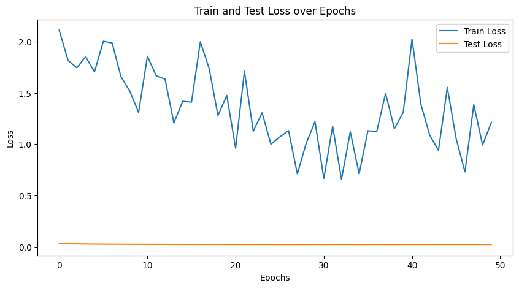
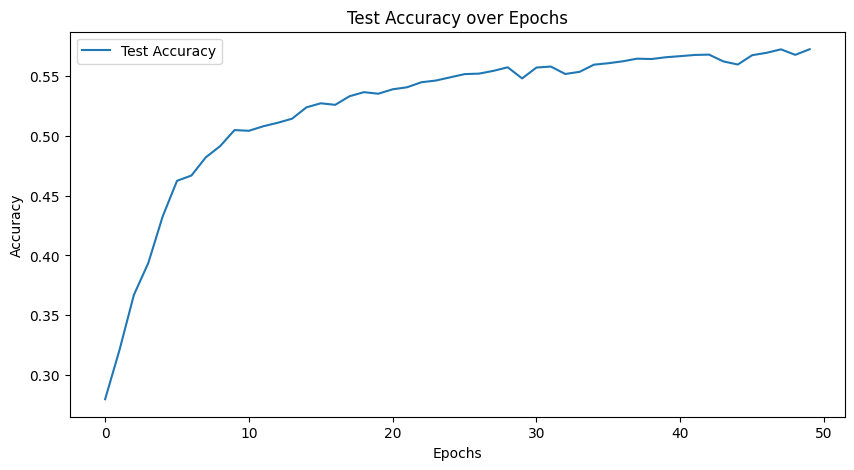

### 代码说明文档

**文档：代码结构和设计说明**

#### 数据集加载和预处理
使用`torchvision`库下载并加载CIFAR-10数据集，并对图像进行了数据增强（随机水平翻转、随机裁剪）和标准化处理。图像被转换为PyTorch张量，并展平为一维向量，以便输入MLP模型。

#### 模型定义
模型使用PyTorch的`nn.Sequential`模块定义了一个更深层次的MLP。网络结构如下：
1. 输入层：32x32x3个特征（展平后的图像）
2. 隐藏层1：2048个神经元，激活函数为ReLU，Dropout
3. 隐藏层2：1024个神经元，激活函数为ReLU，Dropout
4. 隐藏层3：512个神经元，激活函数为ReLU，Dropout
5. 隐藏层4：256个神经元，激活函数为ReLU，Dropout
6. 隐藏层5：128个神经元，激活函数为ReLU，Dropout
7. 隐藏层6：64个神经元，激活函数为ReLU，Dropout
8. 输出层：10个神经元（对应10个类别）

```python
self.linear_relu_stack = nn.Sequential(
    nn.Linear(32 * 32 * 3, 2048),
    nn.ReLU(),
    nn.Dropout(0.5),
    nn.Linear(2048, 1024),
    nn.ReLU(),
    nn.Dropout(0.5),
    nn.Linear(1024, 512),
    nn.ReLU(),
    nn.Dropout(0.5),
    nn.Linear(512, 256),
    nn.ReLU(),
    nn.Dropout(0.5),
    nn.Linear(256, 128),
    nn.ReLU(),
    nn.Dropout(0.5),
    nn.Linear(128, 64),
    nn.ReLU(),
    nn.Dropout(0.5),
    nn.Linear(64, 10)
)
```

#### 训练和评估
在每个训练周期（epoch）中，模型会在训练集上进行前向和反向传播以优化参数，并在测试集上评估损失和准确率。结果会在每个周期结束后打印出来。

#### 可视化结果
训练完成后，生成并保存了训练和测试损失以及测试集准确率的图像，用于观察模型的训练过程。

### 相关截图
训练和测试损失图：


测试集准确率图：


