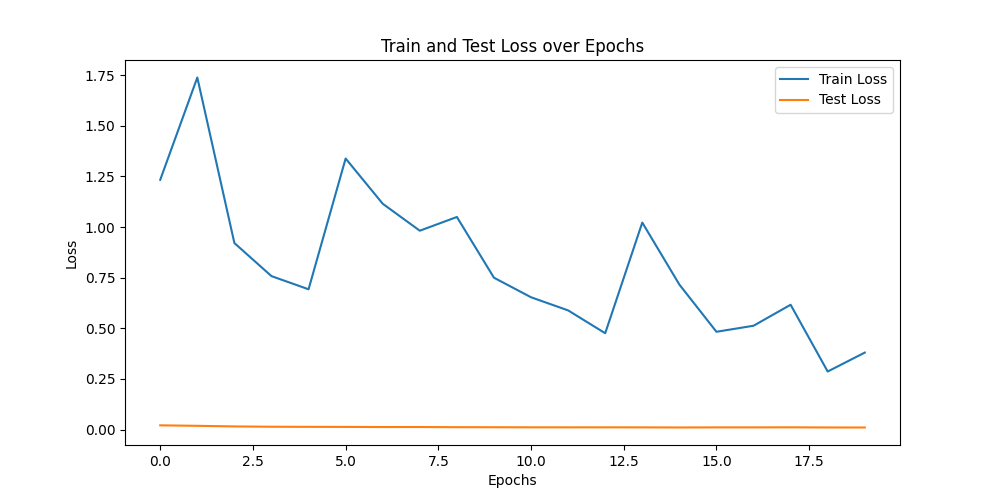
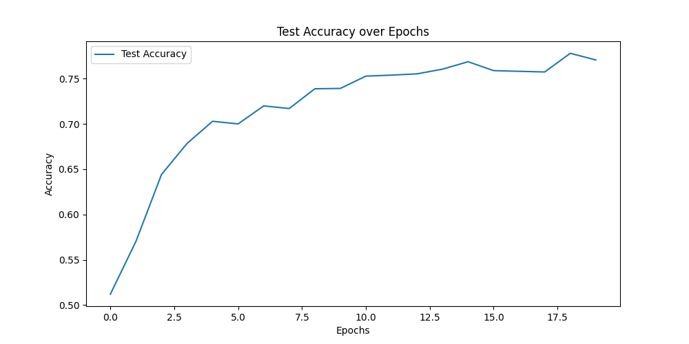

### 代码结构和设计说明文档


#### 数据集加载和预处理
使用`torchvision`库下载并加载CIFAR-10数据集，并对图像进行了数据增强（随机水平翻转、随机裁剪）和标准化处理。图像被转换为PyTorch张量，并作为输入提供给CNN模型。

#### 模型定义
模型使用PyTorch的`nn.Sequential`模块定义了一个卷积神经网络（CNN）。网络结构如下：
1. 卷积层1：输入通道3，输出通道32，3x3卷积，ReLU激活，2x2最大池化
2. 卷积层2：输入通道32，输出通道64，3x3卷积，ReLU激活，2x2最大池化
3. 卷积层3：输入通道64，输出通道128，3x3卷积，ReLU激活，2x2最大池化
4. 全连接层1：输入特征数128*4*4，输出512个神经元，ReLU激活，Dropout
5. 全连接层2：输入512个神经元，输出256个神经元，ReLU激活，Dropout
6. 全连接层3：输入256个神经元，输出10个神经元（对应10个类别）

```python
self.conv_layers = nn.Sequential(
    nn.Conv2d(3, 32, kernel_size=3, padding=1),
    nn.ReLU(),
    nn.MaxPool2d(kernel_size=2, stride=2),
    nn.Conv2d(32, 64, kernel_size=3, padding=1),
    nn.ReLU(),
    nn.MaxPool2d(kernel_size=2, stride=2),
    nn.Conv2d(64, 128, kernel_size=3, padding=1),
    nn.ReLU(),
    nn.MaxPool2d(kernel_size=2, stride=2)
)
self.fc_layers = nn.Sequential(
    nn.Linear(128 * 4 * 4, 512),
    nn.ReLU(),
    nn.Dropout(0.5),
    nn.Linear(512, 256),
    nn.ReLU(),
    nn.Dropout(0.5),
    nn.Linear(256, 10)
)
```

#### 训练和评估
在每个训练周期（epoch）中，模型会在训练集上进行前向和反向传播以优化参数，并在测试集上评估损失和准确率。结果会在每个周期结束后打印出来。

#### 可视化结果
训练完成后，生成并保存了训练和测试损失以及测试集准确率的图像，用于观察模型的训练过程。


### 相关截图
训练和测试损失图：


测试集准确率图：


